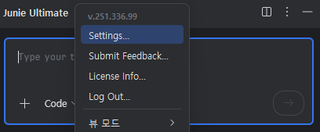
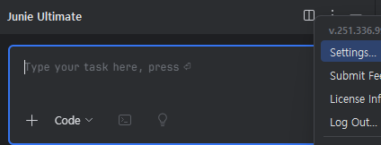

# IntelliJ IDEA에서 Junie 플러그인 사용 가이드

이 가이드는 IntelliJ IDEA에서 Junie 플러그인을 설치하고, 활성화하며, 사용하는 방법에 대한 상세한 안내입니다.

## 목차
1. [Junie 플러그인 소개](#junie-플러그인-소개)
2. [설치 방법](#설치-방법)
3. [활성화 방법](#활성화-방법)
4. [Junie 설정 접근하기](#Junie-설정-접근하기)
5. [문제 해결](#문제-해결)

## Junie 플러그인 소개

Junie는 IntelliJ IDEA를 위한 AI 코딩 어시스턴트 플러그인으로, 코드 작성, 리팩토링, 디버깅 등 다양한 개발 작업을 지원합니다. JetBrains에서 개발한 이 플러그인은 개발자의 생산성을 크게 향상시키는 데 도움이 됩니다.

## 설치 방법

### 방법 1: IntelliJ IDEA 내부 플러그인 마켓플레이스에서 설치

1. IntelliJ IDEA를 실행합니다.
2. `File` > `Settings`(Windows/Linux) 또는 `IntelliJ IDEA` > `Preferences`(macOS)를 선택합니다.
3. 왼쪽 패널에서 `Plugins`를 클릭합니다.
4. `Marketplace` 탭을 선택합니다.
5. 검색 상자에 `Junie`를 입력합니다.
6. 검색 결과에서 Junie 플러그인을 찾아 `Install` 버튼을 클릭합니다.
7. 설치가 완료되면 IDE를 재시작합니다.

### 방법 2: 플러그인 웹사이트에서 다운로드하여 설치

1. [JetBrains 플러그인 저장소](https://plugins.jetbrains.com/)에 접속합니다.
2. 검색 상자에 `Junie`를 입력하여 플러그인을 찾습니다.
3. Junie 플러그인 페이지에서 사용 중인 IntelliJ IDEA 버전과 호환되는 버전을 다운로드합니다.
4. IntelliJ IDEA를 실행하고 `File` > `Settings`(Windows/Linux) 또는 `IntelliJ IDEA` > `Preferences`(macOS)를 선택합니다.
5. 왼쪽 패널에서 `Plugins`를 클릭하고 설정 아이콘(⚙️)을 클릭한 후 `Install Plugin from Disk...`를 선택합니다.
6. 다운로드한 플러그인 파일을 선택하고 `OK`를 클릭합니다.
7. IDE를 재시작하여 플러그인을 활성화합니다.

## 활성화 방법

Junie 플러그인을 설치한 후 활성화하려면 다음 단계를 따르세요:

1. IntelliJ IDEA를 재시작한 후, `Tools` 메뉴에서 `Junie` 옵션을 찾을 수 있습니다.
2. `Junie` > `Settings`를 클릭하여 설정 창을 엽니다.
3. API 키가 필요한 경우, 키를 입력하고 `Apply` 또는 `OK`를 클릭합니다.
   - API 키는 [JetBrains 계정](https://account.jetbrains.com/)에서 확인할 수 있습니다.
   - 또는 무료 체험판을 사용할 수 있는 옵션을 선택할 수 있습니다.
4. 활성화 상태를 확인하려면 IDE 하단 상태 표시줄에서 Junie 아이콘을 확인하세요. 녹색으로 표시되면 활성화된 상태입니다.

## Junie 설정 접근하기

Junie 설정에 접근하는 방법은 다음과 같습니다:

1. Junie Ultimate에 커서를 올려놓고, 오른쪽 마우스클릭으로 `Settings`를 선택하시거나 또는 `...` 버튼을 눌러 Junie 설정에 접근합니다.

## 문제 해결

Junie 플러그인 사용 중 문제가 발생할 경우 다음 조치를 취하세요:

### 일반적인 문제

1. **플러그인이 응답하지 않음**
   - IntelliJ IDEA를 재시작합니다.
   - `File` > `Invalidate Caches / Restart...`를 선택하고 캐시를 초기화합니다.

2. **API 키 오류**
   - 설정에서 API 키가 올바르게 입력되었는지 확인합니다.
   - JetBrains 계정에서 구독 상태를 확인합니다.

3. **성능 문제**
   - `Junie` > `Settings`에서 성능 옵션을 조정합니다.
   - 불필요한 플러그인을 비활성화하여 IDE 성능을 개선합니다.

### 로그 확인 방법

문제를 더 자세히 진단하려면 로그 파일을 확인하세요:

1. `Help` > `Show Log in Explorer`(Windows), `Show Log in Finder`(macOS), 또는 `Show Log in Files`(Linux)를 선택합니다.
2. 로그 파일에서 "Junie"를 검색하여 관련 오류 메시지를 찾습니다.

### 지원 요청

추가 지원이 필요한 경우:
1. [JetBrains 지원 포털](https://www.jetbrains.com/support/)을 방문하세요.
2. `Junie` > `Help` > `Report Issue`를 통해 직접 문제를 보고할 수 있습니다.

---

Junie 플러그인을 통해 개발 생산성을 크게 향상시키고, AI의 도움으로 더 나은 코드를 작성하세요!