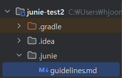
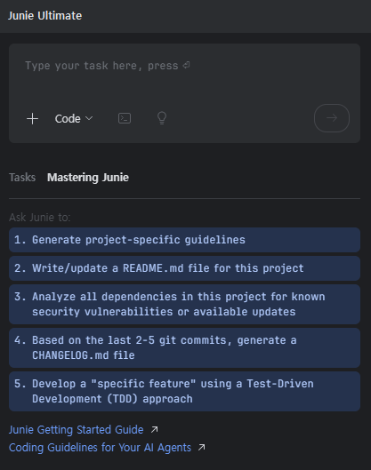

# guideline.md 생성 가이드

이 문서는 Junie 설정을 통해 프로젝트에 필요한 guideline.md 파일을 생성하는 방법에 대한 상세한 안내입니다.

## 목차
1. [개요](#개요)
2. [사전 준비](#사전-준비)
3. [guideline.md 생성 방법](#guidelinemd-생성-방법)
4. [문제 해결](#문제-해결)

## 개요

Junie는 프로젝트에 필요한 다양한 문서를 자동으로 생성할 수 있는 기능을 제공합니다. 이 중 guideline.md는 프로젝트의 코딩 스타일, 구조, 기여 방법 등에 대한 가이드라인을 담고 있는 중요한 문서입니다. 이 가이드에서는 Junie 설정을 통해 프로젝트에 맞는 guideline.md를 쉽게 생성하는 방법을 안내합니다.

## 사전 준비

guideline.md를 생성하기 전에 다음 사항을 확인하세요:

1. IntelliJ IDEA에 Junie 플러그인이 설치되어 있어야 합니다.
2. Junie 플러그인이 활성화되어 있어야 합니다.
3. 프로젝트가 열려 있어야 합니다.
4. 프로젝트의 기본 구조가 설정되어 있어야 합니다.


## guideline.md 생성 방법


### A. 일반 생성 방법
1. root 경로에 있는 .junie 디렉토리 안에 guidelines.md 이름으로 파일을 생성합니다.

2. guidelines.md 안에 원하시는 스크립트를 넣어줍니다. (해당 스크립트로 Junie에게 규칙을 만들어줄 수 있습니다.)


2-1. Mastering Junie 기본 스크립트

---
      Please record in `.junie/guidelines.md` any relevant details that will aid future development on this project. This should include, but is not limited to:
   
      1. **Build/Configuration Instructions**: If specific build or configuration steps are required, provide clear and detailed instructions for setting up the project.
   
      2. **Testing Information**:
         - Instructions for configuring and running tests.
         - Guidelines on adding and executing new tests.
         - Create and run a simple test to demonstrate the process.
   
      3. **Additional Development Information**: Information about the code style or any other information you believe would be useful for the development or debugging process.

      **Important Notes**:
         - This information is intended for an advanced developer; there's no need to include basic things, only information specific to this project.
         - Сheck that the test examples work before writing the information to the file.
         - At the end delete all additional files that you created except `.junie/guidelines.md`


**2-2. 가위바위보 프로젝트 스크립트 예시**

---
         # 가위바위보 프로젝트 개발 가이드라인
         
         ## 빌드/설정 지침
         
         ### 사전 요구사항
         - JDK 11 이상
           - Gradle 7.0+ (프로젝트에 Gradle 래퍼 포함됨)
         
         ### 프로젝트 빌드하기
         이 프로젝트는 Gradle을 빌드 도구로 사용합니다. Gradle 래퍼가 포함되어 있으므로 Gradle을 별도로 설치할 필요가 없습니다.
         
         ```bash
         # 프로젝트 빌드
         .\gradlew build
         
         # 애플리케이션 실행
         .\gradlew run
         
         # 빌드 디렉토리 정리
         .\gradlew clean
         ```
         
         ### 프로젝트 구조
         - `src/main/java/org/example/` - 애플리케이션 소스 코드 포함
            - `Main.java` - 게임 로직이 있는 메인 애플리케이션 클래스
           - `src/test/java/org/example/` - 테스트 클래스 포함
              - `MainTest.java` - Main 클래스에 대한 종합적인 테스트
              - `DemoTest.java` - 테스트 패턴을 보여주는 예제 테스트
         
         ## 테스트 정보
         
         ### 테스트 실행하기
         테스트는 Gradle 래퍼를 사용하여 실행할 수 있습니다:
         
         ```bash
         # 모든 테스트 실행
         .\gradlew test
         
         # 특정 테스트 클래스 실행
         .\gradlew test --tests "org.example.MainTest"
         
         # 특정 테스트 메소드 실행
         .\gradlew test --tests "org.example.MainTest.testChoiceNames"
         ```
         
         ### 테스트 결과
         테스트 결과는 테스트 실행 후 `build/reports/tests/test/index.html` 파일에서 확인할 수 있습니다. 이 파일을 웹 브라우저에서 열어 자세한 테스트 결과를 확인하세요.
         
         ### 새 테스트 추가하기
         테스트는 JUnit 5를 사용합니다. 새 테스트를 추가할 때 다음 패턴을 따르세요:
         
         1. `src/test/java/org/example` 디렉토리에 새 테스트 클래스 생성
            2. 적절한 JUnit 5 어노테이션 사용:
               - `@Test` - 메소드를 테스트로 표시
               - `@DisplayName` - 테스트에 사용자 정의 이름 제공
               - `@RepeatedTest` - 테스트를 여러 번 실행 (무작위 동작 테스트에 유용)
               - `@BeforeEach` / `@AfterEach` - 설정/정리 메소드
               - `@Disabled` - 테스트 일시적으로 비활성화
         
            3. `org.junit.jupiter.api.Assertions` 클래스의 어서션 메소드 사용
               - `assertEquals` - 동등성 확인
               - `assertTrue` / `assertFalse` - 불리언 조건 확인
               - `assertNotNull` / `assertNull` - 객체 존재 확인
               - `assertThrows` - 예외 발생 확인
         
         ### 테스트 예제
         
         다음은 가위바위보 게임에 대한 간단한 테스트 예제입니다:
         
         ```java
         @Test
         @DisplayName("Choice 열거형이 올바른 요소 수를 가지는지 확인")
         public void testChoiceEnumCount() {
             assertEquals(3, Main.Choice.values().length, "Choice 열거형은 정확히 3개의 요소를 가져야 합니다");
         }
         
         @Test
         @DisplayName("getRandomChoice가 null이 아닌 값을 반환하는지 확인")
         public void testRandomChoice() {
             Main.Choice choice = Main.Choice.getRandomChoice();
             assertNotNull(choice, "무작위 선택은 null이 아니어야 합니다");
             System.out.println("[DEBUG_LOG] 생성된 무작위 선택: " + choice.getKorean());
         }
         ```
         
         ### 테스트 디버깅
         `System.out.println()`에 `[DEBUG_LOG]` 접두사를 사용하여 테스트에 디버그 로깅을 추가하세요:
         
         ```java
         System.out.println("[DEBUG_LOG] 디버그 메시지");
         ```
         
         ## 추가 개발 정보
         
         ### 코드 스타일
         이 프로젝트는 표준 Java 코딩 규칙을 따릅니다:
         - 클래스 이름은 파스칼 케이스 사용 (예: `MainTest`)
           - 메소드 이름은 카멜 케이스 사용 (예: `determineWinner`)
           - 상수는 대문자 스네이크 케이스 사용 (예: `ROCK`, `PAPER`, `SCISSORS`)
         
         ### 게임 아키텍처
         - 게임은 선택지(`Main.Choice`)와 결과(`Main.GameResult`)를 나타내는 열거형 사용
           - 게임 로직은 `determineWinner` 메소드에 구현됨
           - 메인 게임 루프는 사용자 입력, 게임 상태, 점수 추적을 처리
         
         ### 일반적인 개발 작업
         
         #### 새 게임 선택지 추가하기
         게임에 새 선택지를 추가하는 방법:
         1. `Main.Choice`에 새 열거형 값 추가
            2. 새 선택지를 처리하도록 `fromInt` 메소드 업데이트
            3. 새 선택지를 게임 로직에 포함하도록 `determineWinner` 메소드 업데이트
            4. 테스트 클래스에 해당하는 테스트 추가
         
         #### 게임 메시지 수정하기
         게임 메시지를 수정하는 방법:
         1. `Main.Choice` 또는 `Main.GameResult`의 열거형 생성자 매개변수 업데이트
            2. 메시지 내용을 확인하는 해당 테스트 업데이트
         
         ### 성능 고려사항
         - 무작위 선택 생성은 이 애플리케이션에 적합한 `java.util.Random`을 사용합니다
           - 프로덕션 등급 애플리케이션의 경우 성능이나 보안을 위해 `ThreadLocalRandom` 또는 `SecureRandom` 사용을 고려하세요
---


### B. Mastering Junie 로 생성하는 방법
1. Junie를 활성화 시킨 후 `Mastering Junie` 탭을 누릅니다.

   

2. `1.Generate project-specific guidelines`버튼을 누릅니다.


## 문제 해결

guideline.md 생성 중 문제가 발생할 경우 다음 조치를 취하세요:

### 일반적인 문제

1. **생성 버튼이 비활성화됨**
   - Junie 플러그인이 최신 버전인지 확인하세요.
   - IDE를 재시작하세요.
   - 프로젝트가 올바르게 로드되었는지 확인하세요.

2. **생성된 guideline.md가 비어 있거나 불완전함**
   - "Analyze Project" 옵션을 활성화하여 다시 시도하세요.
   - 다른 템플릿을 선택하여 다시 시도하세요.
   - Junie 설정에서 "Reset Defaults"를 클릭한 후 다시 시도하세요.

3. **분석 과정에서 오류 발생**
   - 프로젝트가 컴파일 오류 없이 빌드되는지 확인하세요.
   - IDE의 메모리 할당을 증가시키세요.
   - 대규모 프로젝트의 경우 "Analysis Depth"를 낮추어 다시 시도하세요.

### 로그 확인

문제 진단을 위해 로그를 확인하세요:

1. `Help` > `Show Log in Explorer`(Windows), `Show Log in Finder`(macOS), 또는 `Show Log in Files`(Linux)를 선택합니다.
2. 로그 파일에서 "Junie" 및 "documentation" 또는 "guideline"을 검색하여 관련 오류 메시지를 찾습니다.

---

Junie의 guideline.md 생성 기능을 활용하여 프로젝트의 일관성과 협업 효율성을 높이세요. 자동 생성된 가이드라인을 기반으로 필요에 따라 내용을 수정하고 확장하는 것이 좋습니다.