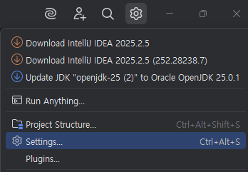
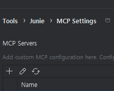
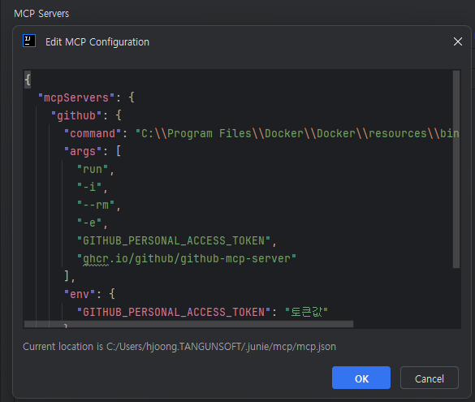
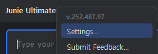
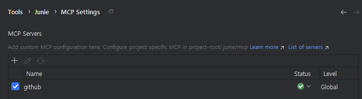

# Junie와 MCP 연동 가이드

이 가이드는 Junie 설정에서 MCP(Model Checkpoint Protocol)를 연동하는 방법을 설명합니다. 프로젝트 구조를 트리 형태로 안내하고, 필요한 mcp.json 파일을 생성하여 GitHub MCP를 구현하는 방법을 자세히 알려드립니다.

## 목차
1. [MCP 개요](#mcp-개요)
2. [사전 준비](#사전-준비)
3. [프로젝트 구조 설정](#프로젝트-구조-설정)
4. [.junie 디렉토리 설정](#junie-디렉토리-설정)
5. [mcp.json 파일 구성](#mcpjson-파일-구성)
6. [GitHub MCP 연동](#github-mcp-연동)
7. [연동 테스트 및 확인](#연동-테스트-및-확인)
8. [문제 해결](#문제-해결)

## MCP 개요

MCP(Model Checkpoint Protocol)는 AI 모델 체크포인트를 관리하고 버전 제어하기 위한 프로토콜입니다. Junie와 MCP를 연동하면 다음과 같은 이점이 있습니다:

- 모델 체크포인트의 일관된 관리
- 프로젝트 간 모델 공유 및 재사용 용이
- 버전 관리를 통한 안정적인 AI 개발 환경 구축
- GitHub와 연동하여 협업 작업 지원

## 사전 준비

MCP 연동을 위해 다음 사항을 확인하세요:

1. IntelliJ IDEA가 설치되어 있어야 합니다.
2. Junie 플러그인이 설치 및 활성화되어 있어야 합니다.
3. Git이 설치되어 있어야 합니다.
4. GitHub 계정이 필요합니다.
5. 기본적인 JSON 형식에 대한 이해가 있어야 합니다.

## 프로젝트 구조 설정

MCP를 연동하기 위한 프로젝트 구조는 다음과 같습니다:

```
my-project/                    # 프로젝트 루트 디렉토리
├── .junie/                    # Junie 설정 디렉토리
│   ├── mcp.json              # MCP 구성 파일
│   └── models/               # 로컬 모델 저장 디렉토리
├── src/                       # 소스 코드 디렉토리
│   ├── main/
│   │   ├── java/             # Java 소스 코드
│   │   └── resources/        # 리소스 파일
│   └── test/                  # 테스트 코드
├── .gitignore                 # Git 무시 파일 목록
├── pom.xml 또는 build.gradle  # 빌드 설정 파일
└── README.md                  # 프로젝트 설명 파일
```

### 프로젝트 구조 생성 방법

1. IntelliJ IDEA에서 새 프로젝트를 생성합니다.
2. 프로젝트가 생성되면, 프로젝트 루트 디렉토리에 `.junie` 디렉토리를 생성합니다:
   - 프로젝트 창에서 프로젝트 루트를 마우스 오른쪽 버튼으로 클릭합니다.
   - `New` > `Directory`를 선택합니다.
   - `.junie`라는 이름을 입력하고 `OK`를 클릭합니다.

3. `.junie` 디렉토리 내에 `models` 디렉토리를 생성합니다:
   - `.junie` 디렉토리를 마우스 오른쪽 버튼으로 클릭합니다.
   - `New` > `Directory`를 선택합니다.
   - `models`라는 이름을 입력하고 `OK`를 클릭합니다.

## .junie 디렉토리 설정

`.junie` 디렉토리는 Junie 플러그인의 설정 파일과 관련 리소스를 저장하는 디렉토리입니다. MCP 연동을 위해서는 이 디렉토리 내에 `mcp.json` 파일을 생성해야 합니다.

### .junie 디렉토리 생성이 안 될 경우

일부 운영 체제에서는 점(.)으로 시작하는 디렉토리 생성이 어려울 수 있습니다. 이 경우 다음 방법을 사용할 수 있습니다:

#### Windows에서:
1. 명령 프롬프트(CMD)를 관리자 권한으로 실행합니다.
2. 프로젝트 디렉토리로 이동합니다:
   ```
   cd path\to\your\project
   ```
3. .junie 디렉토리를 생성합니다:
   ```
   mkdir .junie
   ```

#### macOS/Linux에서:
1. 터미널을 엽니다.
2. 프로젝트 디렉토리로 이동합니다:
   ```
   cd path/to/your/project
   ```
3. .junie 디렉토리를 생성합니다:
   ```
   mkdir .junie
   ```

## mcp.json 파일 구성

1. MCP 연동을 위해 Settings를 열어줍니다.

    
2. '+' 버튼을 눌러 MCP 설정을 열어줍니다.

    

3. Github MCP 구성을 위해 아래와 같이 json 스크립트를 넣어줍니다.

    

### 기본 Github mcp.json 스크립트

'github mcp'를 위해 다음과 같은 기본 구성이 포함되어야 합니다:

```json
{
  "mcpServers": {
    "github": {
      "command": "<docker.exe가 있는 경로>",
      "args": [
        "run",
        "-i",
        "--rm",
        "-e",
        "GITHUB_PERSONAL_ACCESS_TOKEN",
        "ghcr.io/github/github-mcp-server"
      ],
      "env": {
        "GITHUB_PERSONAL_ACCESS_TOKEN": "<Github 토큰 값(PAT)>"
      }
    }
  }
}
```


## 연동 테스트 및 확인

Junie와 MCP 연동이 제대로 작동하는지 확인합니다:

### 1. IntelliJ IDEA에서 Junie 설정 확인

1. IntelliJ IDEA에서 junie 를 오른쪽 마우스 클릭으로 Setting에 들어가 `Tools` > `Junie` > `Settings`를 선택합니다.
2. "Model" 또는 "MCP" 탭을 선택합니다.
3. 설정된 모델이 목록에 표시되는지 확인합니다.


### 2. Junie 명령을 통한 확인

1. 편집기에서 Junie를 호출합니다: `Alt+J`(Windows/Linux) 또는 `Option+J`(macOS)
2. 다음 프롬프트를 입력합니다:
   ```
   MCP 설정을 확인하고 연결된 모델을 보여줘
   ```
3. Junie가 연결된 MCP 설정과 사용 가능한 모델을 보여주는지 확인합니다.

## 문제 해결

MCP 연동 과정에서 발생할 수 있는 일반적인 문제와 해결 방법입니다:

### 인증 오류

- **문제**: GitHub 토큰 인증 오류가 발생하는 경우
- **해결방법**:
  1. 환경 변수 `GITHUB_TOKEN`이 올바르게 설정되었는지 확인합니다.
  2. GitHub 토큰이 필요한 권한을 가지고 있는지 확인합니다.
  3. 토큰이 만료되지 않았는지 확인하고, 필요한 경우 새 토큰을 생성합니다.

### 저장소 경로 오류

- **문제**: 모델 경로를 찾을 수 없는 경우
- **해결방법**:
  1. mcp.json의 `repository` 값이 올바른지 확인합니다.
  2. `path` 설정이 GitHub 저장소의 실제 경로와 일치하는지 확인합니다.
  3. `branch` 설정이 올바른지 확인합니다.

### 캐시 문제

- **문제**: 모델이 로컬 캐시에 저장되지 않는 경우
- **해결방법**:
  1. `.junie/models` 디렉토리가 존재하고 쓰기 가능한지 확인합니다.
  2. mcp.json의 `cache.location` 경로가 올바른지 확인합니다.
  3. Junie 설정에서 캐시를 수동으로 비우고 다시 동기화합니다.

### 로그 확인

문제 진단을 위해 Junie 로그를 확인합니다:

1. `Help` > `Show Log in Explorer`(Windows), `Show Log in Finder`(macOS), 또는 `Show Log in Files`(Linux)를 선택합니다.
2. 로그 파일에서 "MCP" 또는 "Model Checkpoint Protocol"을 검색하여 관련 오류 메시지를 찾습니다.

---

이 가이드를 따라 Junie와 MCP를 성공적으로 연동하면, 프로젝트에서 일관된 AI 모델을 사용하고 팀원들과 효율적으로 공유할 수 있습니다. GitHub를 통한 MCP 연동은 모델 버전 관리와 협업을 크게 향상시키는 강력한 기능입니다.