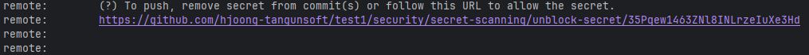
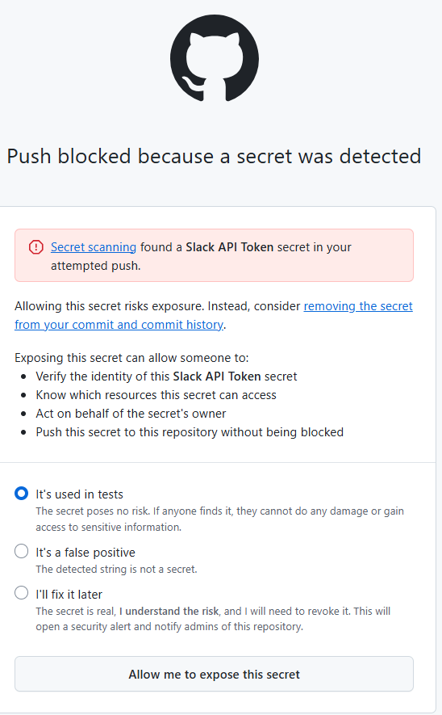

# CI-Security 예시(초보자 가이드)

이 디렉토리는 보안 파이프라인을 빠르게 도입하기 위한 템플릿을 제공합니다. 템플릿은 바로 동작 가능한 수준의 예시이며, 조직 표준에 맞게 수정해 사용하세요.

포함 내용
- SAST: 코드 정적 분석(예: SpotBugs, ESLint 등)
- DAST: 배포/샌드박스 대상 동적 스캔(예: OWASP ZAP Baseline)
- Dependency Audit + SBOM: 취약 의존성 검사(OWASP Dependency-Check) 및 SBOM(CycloneDX)
- Secret Scanning: `gitleaks` 기반 시크릿 탐지

파일 설명
- `github-actions.security.yml` → GitHub Actions 템플릿(이 파일을 `.github/workflows/security.yml`로 복사)
- `gitleaks.toml` → gitleaks 기본 설정(허용리스트/제외 규칙 포함 샘플)
- `zap-rules.tsv` → ZAP Baseline에서 규칙 심각도 조정 샘플

빠른 적용 방법
1) 사용하는 CI 플랫폼 확인(GitHub)
2) 해당 템플릿 파일을 프로젝트 루트로 복사
   - GitHub: `.github/workflows/security.yml`
3) 커밋/푸시하면 보안 파이프라인이 자동 실행됩니다.
   - 참고: 데모용 시크릿 파일로 인해 GitHub Push Protection이 푸시를 차단할 수 있습니다. 데모 목적이라면 차단 메시지의 'allow the secret' 링크로 1회 우회 후 실행하세요. 이후에는 파일 삭제/히스토리 정리를 권장합니다.
   1) 우회 실행 방법
      1) 차단 메시지에서 링크 찾기
      
         git push 후 터미널에 아래와 비슷한 메시지가 보입니다:
         - remote: error: GH013: Repository rule violations...
         - Push cannot contain secrets
         - To push, remove secret from commit(s) or follow this URL to allow the secret.
         - 그 아래에 https://github.com/.../security/secret-scanning/unblock-secret/... 형태의 링크가 나옵니다.
           
         - 이 링크가 바로 “allow the secret” 우회 링크입니다. 링크를 클릭(또는 복사해서 브라우저 주소창에 붙여넣기)하세요.

   2) GitHub에서 우회 승인하기
      
      - 브라우저가 열리면 GitHub 로그인 화면이 나올 수 있습니다. 로그인 후 진행하세요.
      - 페이지 제목/내용 예시:
        - Secret type(예: Slack API Token)
      - 다음 순서로 진행합니다:
        1) “Reason” 또는 “Justification” 박스에 우회 사유를 간단히 작성합니다. 예: 데모/교육 목적으로 1회 우회하여 CI 파이프라인 동작 확인.
        2) 안내에 따라 확인 체크박스를 선택합니다.
        3) Allow secret 또는 Unblock 버튼을 클릭합니다.
        - 참고 사항
          - 저장소/조직 정책에 따라 우회가 금지되어 있을 수 있습니다. 이 경우 관리자가 설정을 바꿔주거나, 별도 테스트 저장소/브랜치를 사용해야 합니다.
          - 우회 기록은 감사 로그에 남으며, 해당 시크릿에 대한 보안 알림이 생성될 수 있습니다.
   3) 다시 push 하기
    - 브라우저에서 우회가 승인되면 터미널로 돌아와 같은 명령을 그대로 다시 실행하세요:
      git push origin main
    - 이제는 같은 커밋이 통과되어 푸시됩니다.
    - 푸시가 완료되면 GitHub Actions의 보안 파이프라인이 자동으로 실행됩니다.
로컬에서 테스트하기
- Secret Scan: `gitleaks detect --source . --redact`
- Dependency Audit (Gradle 예): `./gradlew dependencyCheckAnalyze cyclonedxBom`
- ZAP Baseline (Docker):
  - 애플리케이션을 `http://localhost:8080`에서 가동
  - `docker run --rm -t owasp/zap2docker-stable zap-baseline.py -t http://localhost:8080 -r zap.html -w ci-security/zap-rules.tsv || true`

결과 해석과 후속 조치
- High/Critical 이슈는 즉시 이슈 트래커에 등록하고, 예외가 필요한 경우 근거를 갖춘 승인/만료일을 문서화하세요.
- 반복 발생 항목은 규칙/정책으로 고도화하여 CI에서 자동 차단하거나 경고를 최소화하세요.

실패 유도 예시(시크릿 스캐닝)
- 다음 5개 파일은 gitleaks가 각각 1개씩 탐지하도록 고의로 작성된 샘플입니다. 실제 비밀값이 아니며, 저장소에서 제거하거나 allowlist로 처리해도 됩니다.
  1) ci-security/examples-secrets/aws_keys.txt → AWS Access Key/Secret Key 패턴
  2) ci-security/examples-secrets/github_pat.txt → GitHub PAT(ghp_...)
  3) ci-security/examples-secrets/slack_token.txt → Slack 토큰(xoxb- ...)
  4) ci-security/examples-secrets/private_key.pem → RSA 개인키 블록
  5) ci-security/examples-secrets/basic_auth_url.txt → 기본 인증 자격증명 포함 URL

동작 확인 방법
- 로컬: 프로젝트 루트에서 `gitleaks detect --source . --redact` 실행 시 최소 5건 이상이 보고됩니다.
- GitHub Actions: `ci-security/github-actions.security.yml`을 `.github/workflows/security.yml`로 복사 후 푸시하면 Security Pipeline에서 gitleaks 단계가 해당 파일들을 탐지합니다.
- 정리: 예시 파일을 삭제하거나, 실제 프로젝트에서는 `gitleaks.toml`의 allowlist에 경로를 추가해(교육/데모 목적일 때만) 경고를 무시할 수 있습니다.
